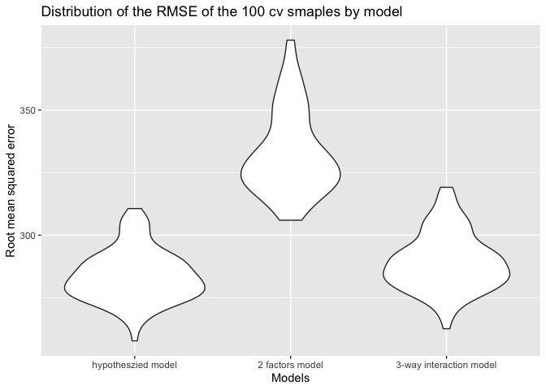

p8105\_hw6\_xm2229
================
Xiaoyue Ma
11/16/2019

## Problem 1

Load and clean the data for regression analysis (i.e. convert numeric to
factor where appropriate, check for missing data, etc.).

``` r
library(tidyverse)
```

    ## ── Attaching packages ─────────────────────────────────────── tidyverse 1.2.1 ──

    ## ✔ ggplot2 3.2.1     ✔ purrr   0.3.3
    ## ✔ tibble  2.1.3     ✔ dplyr   0.8.3
    ## ✔ tidyr   1.0.0     ✔ stringr 1.4.0
    ## ✔ readr   1.3.1     ✔ forcats 0.4.0

    ## ── Conflicts ────────────────────────────────────────── tidyverse_conflicts() ──
    ## ✖ dplyr::filter() masks stats::filter()
    ## ✖ dplyr::lag()    masks stats::lag()

``` r
raw_bw = read_csv("data/birthweight.csv")
```

    ## Parsed with column specification:
    ## cols(
    ##   .default = col_double()
    ## )

    ## See spec(...) for full column specifications.

``` r
janitor::clean_names(raw_bw) %>%
  ## check for missing values
  skimr::skim()
```

    ## Skim summary statistics
    ##  n obs: 4342 
    ##  n variables: 20 
    ## 
    ## ── Variable type:numeric ───────────────────────────────────────────────────────
    ##  variable missing complete    n      mean      sd     p0     p25     p50
    ##   babysex       0     4342 4342    1.49     0.5     1       1       1   
    ##     bhead       0     4342 4342   33.65     1.62   21      33      34   
    ##   blength       0     4342 4342   49.75     2.72   20      48      50   
    ##       bwt       0     4342 4342 3114.4    512.15  595    2807    3132.5 
    ##     delwt       0     4342 4342  145.57    22.21   86     131     143   
    ##   fincome       0     4342 4342   44.11    25.98    0      25      35   
    ##     frace       0     4342 4342    1.66     0.85    1       1       2   
    ##   gaweeks       0     4342 4342   39.43     3.15   17.7    38.3    39.9 
    ##   malform       0     4342 4342    0.0035   0.059   0       0       0   
    ##  menarche       0     4342 4342   12.51     1.48    0      12      12   
    ##   mheight       0     4342 4342   63.49     2.66   48      62      63   
    ##    momage       0     4342 4342   20.3      3.88   12      18      20   
    ##     mrace       0     4342 4342    1.63     0.77    1       1       2   
    ##    parity       0     4342 4342    0.0023   0.1     0       0       0   
    ##   pnumlbw       0     4342 4342    0        0       0       0       0   
    ##   pnumsga       0     4342 4342    0        0       0       0       0   
    ##     ppbmi       0     4342 4342   21.57     3.18   13.07   19.53   21.03
    ##      ppwt       0     4342 4342  123.49    20.16   70     110     120   
    ##    smoken       0     4342 4342    4.15     7.41    0       0       0   
    ##    wtgain       0     4342 4342   22.08    10.94  -46      15      22   
    ##      p75   p100     hist
    ##     2       2   ▇▁▁▁▁▁▁▇
    ##    35      41   ▁▁▁▁▅▇▁▁
    ##    51      63   ▁▁▁▁▁▇▁▁
    ##  3459    4791   ▁▁▁▃▇▇▂▁
    ##   157     334   ▁▇▅▁▁▁▁▁
    ##    65      96   ▁▂▇▂▂▂▁▃
    ##     2       8   ▇▇▁▁▁▁▁▁
    ##    41.1    51.3 ▁▁▁▁▃▇▁▁
    ##     0       1   ▇▁▁▁▁▁▁▁
    ##    13      19   ▁▁▁▁▂▇▁▁
    ##    65      77   ▁▁▁▅▇▂▁▁
    ##    22      44   ▂▇▅▂▁▁▁▁
    ##     2       4   ▇▁▇▁▁▁▁▁
    ##     0       6   ▇▁▁▁▁▁▁▁
    ##     0       0   ▁▁▁▇▁▁▁▁
    ##     0       0   ▁▁▁▇▁▁▁▁
    ##    22.91   46.1 ▁▇▅▁▁▁▁▁
    ##   134     287   ▁▇▆▁▁▁▁▁
    ##     5      60   ▇▁▁▁▁▁▁▁
    ##    28      89   ▁▁▁▇▇▁▁▁

convert some of the the numeric variables to factor variables as stated
in the introduction.

``` r
cleaned_bw = raw_bw %>%
  mutate(babysex = case_when(babysex == 1 ~ "male", 
                             babysex == 2 ~ "female"),
         frace = case_when(frace == 1 ~ "white",
                           frace == 2 ~ "black",
                           frace == 3 ~ "asian",
                           frace == 4 ~ "puerto rican", 
                           frace == 8 ~ "other",
                           frace == 9 ~ "unknown"),
         malform = case_when(malform == 0 ~ "absent",
                             malform == 1 ~ "present"),
         mrace = case_when(mrace == 1 ~ "white",
                           mrace == 2 ~ "black",
                           mrace == 3 ~ "asian",
                           mrace == 4 ~ "puerto rican", 
                           mrace == 8 ~ "other")) %>%
  mutate(babysex = forcats::fct_relevel(babysex, "male", "female"),
         frace = forcats::fct_relevel(frace, "white", "black","asian","puerto rican", "other","unknow"),
         malform = forcats::fct_relevel(malform, "absent", "present"),
         mrace = forcats::fct_relevel(mrace, "white", "black", "asian", "puerto rican"))
```

    ## Warning: Unknown levels in `f`: unknow

``` r
skimr::skim(cleaned_bw)
```

    ## Skim summary statistics
    ##  n obs: 4342 
    ##  n variables: 20 
    ## 
    ## ── Variable type:factor ────────────────────────────────────────────────────────
    ##  variable missing complete    n n_unique
    ##   babysex       0     4342 4342        2
    ##     frace       0     4342 4342        5
    ##   malform       0     4342 4342        2
    ##     mrace       0     4342 4342        4
    ##                               top_counts ordered
    ##              mal: 2230, fem: 2112, NA: 0   FALSE
    ##  whi: 2123, bla: 1911, pue: 248, asi: 46   FALSE
    ##                abs: 4327, pre: 15, NA: 0   FALSE
    ##  whi: 2147, bla: 1909, pue: 243, asi: 43   FALSE
    ## 
    ## ── Variable type:numeric ───────────────────────────────────────────────────────
    ##  variable missing complete    n      mean     sd     p0     p25     p50
    ##     bhead       0     4342 4342   33.65     1.62  21      33      34   
    ##   blength       0     4342 4342   49.75     2.72  20      48      50   
    ##       bwt       0     4342 4342 3114.4    512.15 595    2807    3132.5 
    ##     delwt       0     4342 4342  145.57    22.21  86     131     143   
    ##   fincome       0     4342 4342   44.11    25.98   0      25      35   
    ##   gaweeks       0     4342 4342   39.43     3.15  17.7    38.3    39.9 
    ##  menarche       0     4342 4342   12.51     1.48   0      12      12   
    ##   mheight       0     4342 4342   63.49     2.66  48      62      63   
    ##    momage       0     4342 4342   20.3      3.88  12      18      20   
    ##    parity       0     4342 4342    0.0023   0.1    0       0       0   
    ##   pnumlbw       0     4342 4342    0        0      0       0       0   
    ##   pnumsga       0     4342 4342    0        0      0       0       0   
    ##     ppbmi       0     4342 4342   21.57     3.18  13.07   19.53   21.03
    ##      ppwt       0     4342 4342  123.49    20.16  70     110     120   
    ##    smoken       0     4342 4342    4.15     7.41   0       0       0   
    ##    wtgain       0     4342 4342   22.08    10.94 -46      15      22   
    ##      p75   p100     hist
    ##    35      41   ▁▁▁▁▅▇▁▁
    ##    51      63   ▁▁▁▁▁▇▁▁
    ##  3459    4791   ▁▁▁▃▇▇▂▁
    ##   157     334   ▁▇▅▁▁▁▁▁
    ##    65      96   ▁▂▇▂▂▂▁▃
    ##    41.1    51.3 ▁▁▁▁▃▇▁▁
    ##    13      19   ▁▁▁▁▂▇▁▁
    ##    65      77   ▁▁▁▅▇▂▁▁
    ##    22      44   ▂▇▅▂▁▁▁▁
    ##     0       6   ▇▁▁▁▁▁▁▁
    ##     0       0   ▁▁▁▇▁▁▁▁
    ##     0       0   ▁▁▁▇▁▁▁▁
    ##    22.91   46.1 ▁▇▅▁▁▁▁▁
    ##   134     287   ▁▇▆▁▁▁▁▁
    ##     5      60   ▇▁▁▁▁▁▁▁
    ##    28      89   ▁▁▁▇▇▁▁▁

According to basic biology, it is hypothesized that the factors that
might affect baby’s birthweight are `bhead`, `blength`, `babysex`,
`delwt`, `malform`, `mheight`, `smoken`, `wtgain`. From the plot below,
we can see that there are a few extreme values that has very high
residuals, which means that there are a few predictions that are off by
a huge value.

``` r
library('ggplot2')
fit = lm(bwt ~ bhead + blength + babysex + delwt + malform + mheight + smoken + wtgain, data = cleaned_bw)

modelr::add_predictions(cleaned_bw, fit) %>%
  modelr::add_residuals(fit) %>%
  ggplot(aes(x = pred, y = resid)) + geom_point() + labs(title = "A plot of Residual against Fitted value for the hypothesized model") + xlab("Fitted Value") + ylab("Residuals")
```

<!-- -->

Compare your model to two others:

  - One using length at birth and gestational age as predictors (main
    effects only)
  - One using head circumference, length, sex, and all interactions
    (including the three-way interaction) between these

The steps taken here is to use `crossv_mc` to split the dataset into
training set and testing set and compare the RMSE (mean square error) to
decide which one is better. According to the plot below, for the 100
cross validation samples generated randomly, the hypothsized model has
overall the lowest root mean squared cross-validated prediction error.
Therefore, the hypothsized model might be a better one.

``` r
cv_df = modelr::crossv_mc(cleaned_bw, 100) %>%
  mutate(train = map(train, as_tibble),
         test = map(test, as_tibble))

cv_result = cv_df %>%
  mutate(hypothsized = map(train, ~lm(bwt ~ bhead + blength + babysex + delwt + malform + mheight + smoken + wtgain, data = .x)),
         bg = map(train, ~lm(bwt ~ blength + gaweeks, data = .x)),
         interaction = map(train, ~lm(bwt ~ bhead + blength + babysex + bhead:blength + blength:babysex + bhead:babysex, data = .x))) %>%
  mutate(rmse_hypothsized = map2_dbl(hypothsized, test, ~modelr::rmse(model = .x, data = .y)),
         rmse_bg = map2_dbl(bg, test, ~modelr::rmse(model = .x, data = .y)),
         rmse_interaction = map2_dbl(interaction, test, ~modelr::rmse(model = .x, data = .y)))
  
cv_result %>%
  select(starts_with("rmse")) %>%
  pivot_longer(
    everything(),
    names_to = "model",
    values_to =  "rmse",
    names_prefix = "rmse_") %>%
  mutate(model = fct_inorder(model)) %>%
  ggplot(aes(x = model, y = rmse)) + geom_violin() + 
  scale_x_discrete(labels = c("hypotheszied model", "2 factors model", "3-way interaction model")) + 
  xlab("Models") + ylab("Root mean squared error") + 
  labs(title = "Distribution of the RMSE of the 100 cv smaples by model")
```

<!-- -->

Moreover, we could also compare the mean RMSE of the 100 generated
corss-validated samples for the three models in the following table. By
verifying the table below, the hypothsized model has a lower RMSE on
average.

``` r
cv_result %>%
  select(starts_with("rmse")) %>%
  pivot_longer(
    everything(),
    names_to = "model",
    values_to =  "rmse",
    names_prefix = "rmse_") %>%
  group_by(model) %>%
  summarise(mean_rmse = mean(rmse)) %>% knitr::kable()
```

| model       | mean\_rmse |
| :---------- | ---------: |
| bg          |   332.7214 |
| hypothsized |   283.6415 |
| interaction |   289.3500 |

## Problem 2

download the weather dataset

``` r
weather_df = 
  rnoaa::meteo_pull_monitors(
    c("USW00094728"),
    var = c("PRCP", "TMIN", "TMAX"), 
    date_min = "2017-01-01",
    date_max = "2017-12-31") %>%
  mutate(
    name = recode(id, USW00094728 = "CentralPark_NY"),
    tmin = tmin / 10,
    tmax = tmax / 10) %>%
  select(name, id, everything())
```

    ## Registered S3 method overwritten by 'hoardr':
    ##   method           from
    ##   print.cache_info httr

    ## file path:          /Users/yeungSL/Library/Caches/rnoaa/ghcnd/USW00094728.dly

    ## file last updated:  2019-11-17 00:42:48

    ## file min/max dates: 1869-01-01 / 2019-11-30

Start to pull 5000 bootstrap samples from `weather_df`

``` r
boot_weather = data_frame(strap_number = 1:5000,
           strap_sample = rerun(5000, sample_frac(weather_df, replace=TRUE)))
```

    ## Warning: `data_frame()` is deprecated, use `tibble()`.
    ## This warning is displayed once per session.

``` r
dim(boot_weather)
```

    ## [1] 5000    2

For each samples run regression `tmax ~ tmin` and extract \(\hat{r}^2\)
and \(log(\hat{\beta_0} * \hat{\beta_1})\).

``` r
results = boot_weather %>%
  mutate(models = map(strap_sample, ~lm(tmax ~ tmin, data = .x)),
         results_glance = map(models, broom::glance),
         results_tidy = map(models, broom::tidy)) %>%
  select(-strap_sample, -models) %>%
  unnest() %>%
  select(strap_number, r.squared, estimate) %>%
  group_by(strap_number) %>%
  summarise(r_squared = unique(r.squared),
            log_prod = log(prod(estimate)))
```

    ## Warning: `cols` is now required.
    ## Please use `cols = c(results_glance, results_tidy)`

``` r
head(results) %>% knitr::kable()
```

| strap\_number | r\_squared | log\_prod |
| ------------: | ---------: | --------: |
|             1 |  0.9104302 |  2.025209 |
|             2 |  0.9152444 |  2.001228 |
|             3 |  0.9077406 |  1.977013 |
|             4 |  0.8993909 |  2.020108 |
|             5 |  0.9176064 |  2.003625 |
|             6 |  0.9247015 |  1.996402 |

Calcualte the 2.5% and 97.5% quantiles for column `r_squared` to get the
95% confidence interval for \(\hat{r}^2\).

``` r
quantile(results$r_squared, probs = c(0.025, 0.975))
```

    ##      2.5%     97.5% 
    ## 0.8941092 0.9273637

Calcualte the 2.5% and 97.5% quantiles for column `log_prod` to get the
95% confidence interval for \(log(\hat{\beta_0} * \hat{\beta_1})\).

``` r
quantile(results$log_prod, probs = c(0.025, 0.975))
```

    ##     2.5%    97.5% 
    ## 1.964631 2.059218
